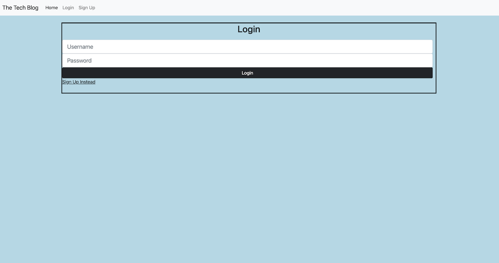

# The Tech Blog

## Badges
  

  ## Table of Contents
  * [License](#license)
  * [Description](#description)
  * [Installation](#installation)
  * [Walk Through](#walkthrough)
  * [Deployed Link](#deployedlink)
  * [Usage](#usage)
  * [Questions](#questions)

  ## License
  Read more about ISC here:
  [ISC] (https://opensource.org/licenses/ISC)

  ## Description
   Our task is to build a CMS-style blog site similar to a Wordpress site, where developers can publish their blog posts and comment on other developers’ posts as well. We'll build this site completely from scratch and deploy it to Heroku. This app will follow the MVC paradigm in its architectural structure, using Handlebars.js as the templating language, Sequelize as the ORM, and the express-session npm package for authentication.

  ## Installation
  1. Install dependencies 
     - express handlebars
     - mysql2
     - Sequelize 
     - bycrypt 
     - dotenv 
     - express session 
     - connect session sequelize
  2. Connect to a Mysql database
  3. Deploy on Heroku

  ## Walk Through

  [Walk Through](https://drive.google.com/file/d/1bJRx12cYCGNSYgjBSmi1noAF8zvb2zm2/view)

  ## Deployed Link

  ## Usage
  The Tech Blog website is available through Heroku.
  While visiting you can see other posts from previous visitors, 
  create your own blog account, add posts and comment. You will also be 
  able to edit and delete posts. 

  
   
  

  ## Questions?
  ### Reach me here: 
  [claire-max](https://github.com/claire-max)  